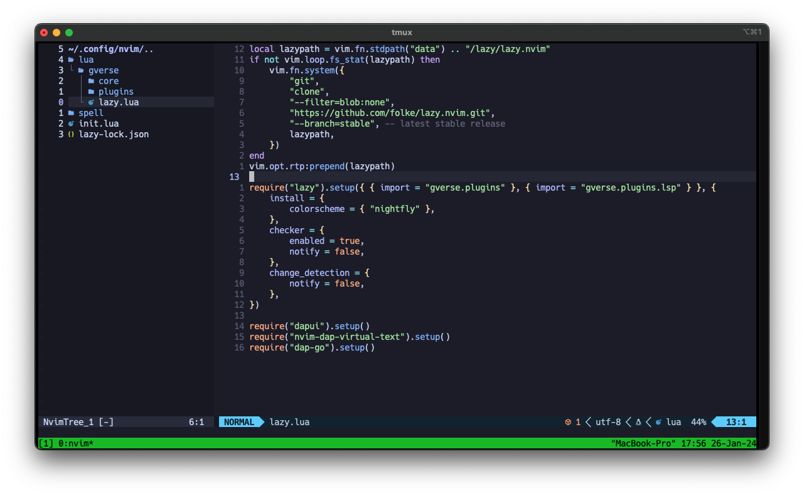

# dotfiles 💻

Este repositório contém as configurações que utilizo em meu ambiente de desenvolvimento. 
Com este conjunto de arquivos, mantenho todas ou a maioria das configurações que utilizo atualizadas e versionadas.

Sinta-se à vontade para abrir uma issue e sugerir melhorias, dar sugestões ou mesmo tirar dúvidas.

Observação: Os passos descritos foram aplicados em um Mac M3; algumas configurações e procedimentos 
podem variar de acordo com o processador ou sistema utilizado.

*Aqui estão as configurações que uso no meu ambiente de desenvolvimento.*



## ⚙️ Configuração

### oh my zsh

[Site Oficial](https://ohmyz.sh/#install)

Consulte a documentação oficial para prosseguir com a instalação. Em resumo, o comando básico é:

```shell
sh -c "$(curl -fsSL https://raw.githubusercontent.com/ohmyzsh/ohmyzsh/master/tools/install.sh)"
```

### Oh My ZSH Plugins

Dentre os plugins existentes, esses são alguns dos meus preferidos:

- zsh-syntax-highlighting

```shell
git clone https://github.com/zsh-users/zsh-syntax-highlighting.git ~/.oh-my-zsh/custom/plugins/zsh-syntax-highlighting
```

- zsh-autosuggestions

```shell
git clone https://github.com/zsh-users/zsh-autosuggestions ~/.oh-my-zsh/custom/plugins/zsh-autosuggestions
```

Após instalados, basta editar o arquivo `.zshrc` para começar a utilizá-los.

```shell
plugins=(
	git
	zsh-autosuggestions
  	zsh-syntax-highlighting
)
```

### Homebrew

[Site Oficial](https://brew.sh)

O Homebrew em uma versão recente alterou o local de instalação. Por este motivo, 
é necessário configurar o novo path. Para tal, edite o arquivo .zshrc e inclua o seguinte:

```shell
eval "$(/opt/homebrew/bin/brew shellenv)"
```

Feche o terminal e abra novamente.
Agora vamos instalar o iTerm2 e o Neovim com os comandos:

```shell
cask install iterm2
brew install neovim
```

Para resolver uma questão de provider do Neovim, vamos instalar o neovim utilizando o pip. 

```shell
pip3 install neovim
```

Para mais informações, consulte: [Neovim Provider](https://neovim.io/doc/user/provider.html)

### NVM

O Node.js também é uma dependência para o Mason e outros recursos que utilizarei no Neovim. 
Então, vamos seguir para a instalação do Node.js. Para melhor gerenciamento das versões, prefiro 
instalar o Node.js via nvm. Dessa forma, primeiro devo instalar o nvm:

[Github](https://github.com/nvm-sh/nvm)

```shell
brew install nvm
```

Configure a variavel de ambiente do NVM adicionando essa linha no arquivo `.zshrc`:

```shell
source $(brew --prefix nvm)/nvm.sh
```

Reinicie o terminal.

Agora sim o Nodejs.
Para listar as versoes disponiveis:


```shell
nvm ls-remote
```

Instalando e usando a versao desejada:

```shell
nvm install 20 
nvm use 20
```

### Outras Dependencias

```shell
brew install gnu-sed
brew install wget
brew install yarn
brew install fd
brew install ripgrep
```

- Nodejs provider para o Neovim

```shell
yarn global add neovim
```

### Go

[Site Oficial](https://go.dev/doc/install)

A instalação do Go é simples, basta fazer o download do arquivo do site e executá-lo.
Agora é preciso configurar as variáveis de ambiente no arquivo .zshrc, deixando desta forma:

```shell
export GOPATH=$HOME/go
export GOBIN=$GOPATH/bin
export PATH=$PATH:$GOBIN
```

### IDE

As minhas configurações, keymaps, plugins, entre outros, já estão configurados nos arquivos `lua`
disponíveis neste repositório em `.config/.nvim`.

O gerenciador de plugins que utilizo é o [Lazy](https://github.com/folke/lazy.nvim). 
Desta forma, é preciso apenas copiar os arquivos para o mesmo caminho localmente.

Após isso, basta abrir o `Neovim`, e o `Lazy` já iniciará e instalará os plugins automaticamente.

Para deixar tudo ajustado para utilizar o `Go`, execute esses dois comandos no `Neovim`:

```shell
:GoInstallBinaries
:TSInstall go
```

### Keyboard

Como o teclado do Mac e Portugues, mas uso um teclado externo no padrao Americano
eu tenho de trocar o `input` do sistema quando troco de um para outro, e por padrao,
o atalho para trocar de idioma eh o `Ctrl+Space`. Como sabemos bem, esse eh um dos atalhos
que mais utilizamos em um IDE. Por este motivo eu configuro o atalho de troca de `input`
para `⌘+k` (k = keyboard) evidando um conflito.

Para realizar essa configuracao de atalho acesse:

`System Settings > Keyboard > Keyboard Shortkuts > Input Sources`


### Install Hack Nerd Font

Essas são umas das fontes mais populares e na minha opinião ajuda muito na leitura de código.
Para instalar basta:

```bash
brew tap homebrew/cask-fonts
brew install --cask font-hack-nerd-font
```

Em seguida altere a fonte atual do iTerm para a nova fonte.


